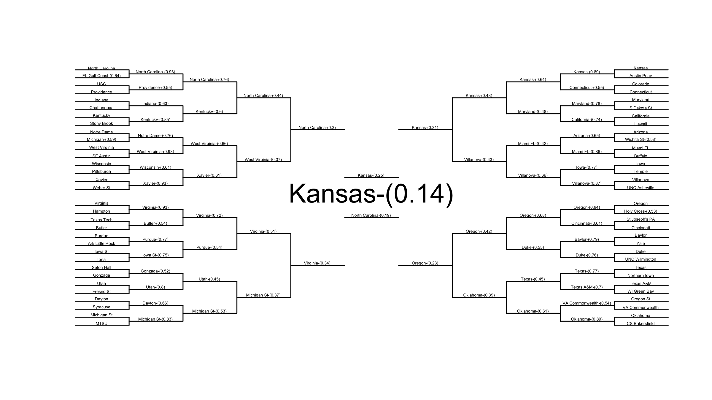
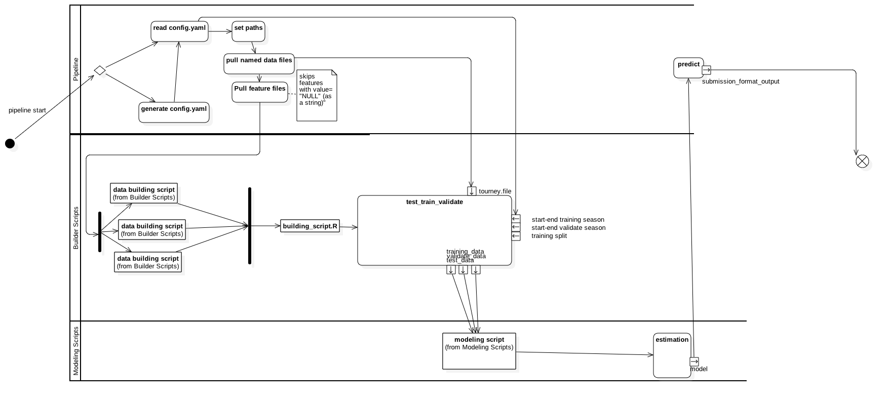

# ncaa_2016 kaggle competition




[](https://zenodo.org/badge/latestdoi/52184011)

# NCAA tournament pipeline



# General principles

* scripts that manipulate data should be placed in data_building
	* builder_script.R should be last script specified in config (see below)
	* should not directly load files or call directories -- pipeline.R will load requested files based on config file. 
	* preceding building scripts should yield or pass object called `tourney.file`

* scripts that run models should be placed in modeling_scripts
	* should not directly load or list paths to  outside data or files. These will be provided by the preceeding data_building scripts and files specified in config
	* scripts should be written to expect three objects already loaded into memory: `test_data`, `training_data`, and `validation_data`
	* modeling_scripts should exit with an object called `model` in memory that can be used with predict
		* pipeline will eventually take this `model` and produce validation data (i'll add this in tomorrow)
* config file:
	* can be R (longer and annoying to edit -- see config.R.example)
	* can also be yaml (easier to write)
	* pipeline.R will automatically write the config.yaml from config.R
	* details on what goes in config file below.


Run with `source("pipeline.R")` from R.

# To use: 


create a config.yaml file that specifies the following: 

```{yaml}


path_to_NCAA: ~/Google Drive/NCAA/
repository_location: /s/Programming/NCAA_2016

first.training.season: 2005
last.training.season: 2009

first.validation.season: 2010
last.validation.season: 2015
training_split:.3

data_building_files:
- data_building/other_scripts.R 
- data_building/builder_script.R
# you should probably always include this file last in this list. 

model_files:
- modeling_scripts/pre_analysis.R # a script to run
- modeling_scripts/analysis03142015.R


data_to_load:
# These are specified as dataset_name: dataset_location -- relative to the ncaa folder
  kaggle.submission.file: 2016_competition/data_2016_specific/kaggle_dataset/SampleSubmission.rds
  season.file: 2016_competition/data_2016_specific/kaggle_dataset/RegularSeasonDetailedResults.csv
  tourney.file: 2016_competition/data_2016_specific/kaggle_dataset/TourneyCompactResults.csv

features_to_add:
  Seed: 2016_competition/data_2016_specific/kaggle_dataset/TourneySeeds.rds
  RPI: General_Data/some_file.csv
  # Note, the name of the element (e.g. RPI) is used as the name in this list.
  # The name of the element here should correspond to the name of the name of
  # the column for the feature in the datafile (e.g. some_file.csv should have a
  # column named RPI).
output_file: submission.csv
# this is where the submission csv will be generated relative to repo root. 

```

Alternatively, you can specifiy this in a file called config.R and the pipeline
will generate the corresponding yaml file for you. This is a more finicky way of
doing this though and the file must be structured very similarly to
config.R.example.

## Description of parameters

### path_to_NCAA

this is required. it is the path to the NCAA folder on your local machine. 

### repository_location

this is required. it is the path to this repo on your local machine.

### features_to_add

These are specified as feature_name: feature_location -- relative to the ncaa
folder. The feature dataset should have 3 columns: one for

### data_to_load

these are the names and locations of the datasets to load in. they are specified
relative to the root of the NCAA folder. At least one of these should be named
`tourney.file'. if using the builder_script, this dataset will form the base
dataset into which features are merged. The tourney.file in the example above is
the location of the compact tourney results file supplied by kaggle.


### last.training.season and first.training.season

these is used by `getTourneyData()` in the builder_script to properly subset
data for a specified set of  seasons. This should not overlap with the
validation.season parameters.

### last.validation.season and first.validation.season

these is used by `test_train_validate_split()` in the builder_script to properly
subset data for a specified set of  seasons for validation. This should be the
range of seasons over which we want to predict outcomes and submit. In the final
round of the competition, this will be 2016 for both values

### training_split

This is the proportion of the training data that you want the builder_script to
hold out for cross validation of the trained model. if your modeling script uses
somethign like carat where you can do more advanced cross validation, you can
set `training_split: 0` in yaml (or put `training_split=0` in the `data_recipe`
list in `config.R`) This will prevent `builder_script.R` from splitting the
training data (`builder_script.R` will still return `test_data`, but it will be
`NULL`)

### data_building_files:

these are files specified relative to the repo root. They are files you want to
run to manipulate data prior to model estimation. You should probably keep the
builder_script as the last element of this list  as this script will properly
transform the tourney data and load features in the `features_to_add` list. The
builder_script file will expect a dataframe called tourney.file to be in memory
and it will return three objects at its conclusion: `test_data`, `training_data`
and `validation_data`.


### model_files: 

these are the model building files that are run to generate model estimates.
these scripts should expect an object called tourneydata and return a model
object with a standard predict method.


### output_file
This is where the submission csv will be generated relative to repo root. 

## short-term changes

I will also add a final step that takes the model object returned from
model_files and use it to produce a kaggle- formatted submission file.


